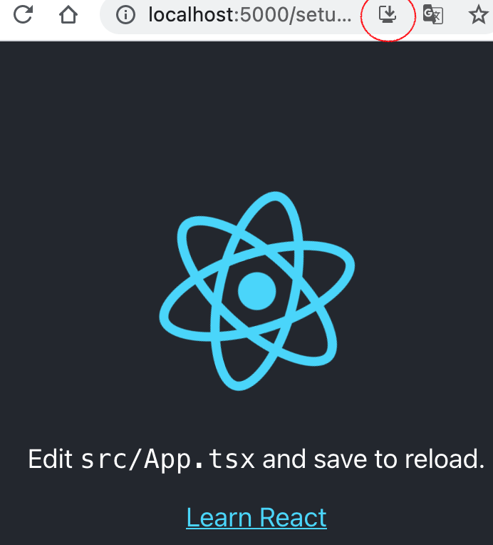

# PWA React アプリケーションを作る

`Written: 2021-07-24`

最近の勉強でPWAという存在を知った。PWAはネイティブアプリケーションのようなUXを提供できるためものすごく魅力的である。今回はPWAを作ることにした。

`create-react-app`を使えば、Reactアプリケーションを素早く作ることができる。そしてPWAをサポートするテンプレートがあるので楽だ。

### create-react-app にてWEBアプリを生成

```
npx create-react-app . --template cra-template-pwa-typescript
```

`cra-template-pwa-typescript` というテンプレートを用いて、Typescript + PWAのアプリケーションを生成する。
既に`manifest.json`や`ServiceWorker`などの設定は完了しているため、残りはブラウザにServiceWorkerを登録するだけ。

### ServiceWorkerを登録

`index.tsx`の内容を一部修正する。
```ts
serviceWorkerRegistration.register();
// serviceWorkerRegistration.unregister();
```

### serveでちゃんと動くか確認する
`service-worker.ts`は`develop`モードでアクセスできないため、PWAとして動かない。ローカルで確認するには必ずビルドし、別のサーバーに載せる必要がある。

`serve`を使えば簡単に確認できるため、今回は`serve`を使うことにした。

```
yarn build
npx serve -s build
```

そしてChromeで確認すると…



PWA専用のダウンロードマークがでた！
