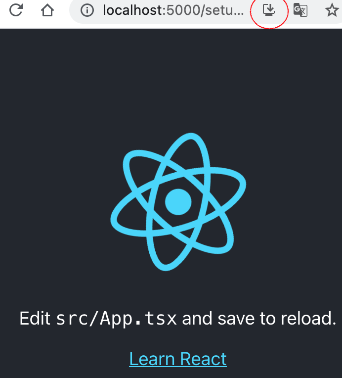

# PWA를 지원하는 React 앱 빠르게 구성하기

`Written: 2021-07-24`

예전부터 스마트폰 앱에는 관심이 많았기 때문에 안드로이드 앱을 만들어 보기도 했고, 리액트 네이티브에 조금 관심을 갖고 공부해볼까 하다가 PWA라는 것을 알게 되었다.

네이티브 앱처럼 구동시킬 수 있다는 점이 무엇보다 매력적이라 생각해 간단한 앱을 만들어 보려고 한다.

리액트의 스타터킷은 역시 `create-react-app`이 제일 간단하고 빠르게 만들 수 있다. 그리고 PWA를 지원하는 템플릿이 있기 때문에 간단하고 빠르게 만들 수 있다.

### create-react-app 으로 앱 생성

```
npx create-react-app . --template cra-template-pwa-typescript
```

`cra-template-pwa-typescript` 라는 템플릿을 이용해 Typescript + PWA가 적용된 앱을 생성한다.

템플릿에는 이미 `manifest.json`,`ServiceWorker` 등의 설정이 완료되어 있고, 남은 건 브라우저에 등록하는 것뿐이다.

### ServiceWorker 등록

`index.tsx` 파일에 있는 내용을 수정한다.
```ts
serviceWorkerRegistration.register();
// serviceWorkerRegistration.unregister();
```

### serve로 동작하는지 확인
`service-worker.ts`는 develop 모드에서는 접근이 불가능하다. 즉 PWA로 돌아가는지 확인이 불가능하다. 로컬에서 확인하려면 빌드한 다음 별도의 서버에 올려 확인해야 한다.

`serve`를 이용하면 빠르게 확인할 수 있으므로 `serve`를 사용하기로 한다.

```
yarn build
npx serve -s build
```

크롬에서 확인하면..



짠! PWA임을 알리는 표시(북마크 추가)가 나타난다.
